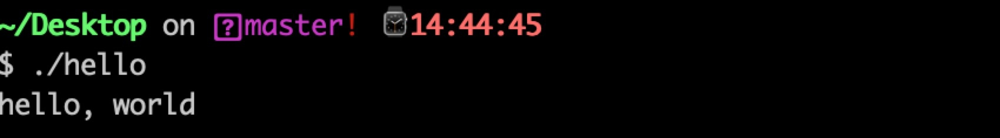

## 信息就是位+上下文
位：也叫比特，英文为Bit，是Binary digit（二进制数字）的缩写，是信息的最小单位。当一件事只有两个选择并且两个选择发生的概率相等，则一个二进制位可以表示其中的一个选择。比如：正负、开关、是否等。另外，1字节=8比特。1个字节可以表示一个文本字符。当然在不同的编译器中不同类型变量占用的字节是不一样的。

| C类型 | 32位 | 64位 | 
|:-------:|:-------|:-------|
|char|1|1|
|short int|2|2|
|int|4|4|
|long int|4|4|
|long long int|8|8|
|char*|4|8|
|float|4|4|
|double|8|8|

上下文：英文为context。翻译为上下文、环境、语境。这个概念有点抽象，可以理解为信息是比较复杂的，单纯的由比特是不能准确的描述信息的，或者说有了语境，比特能更好的解释信息，不同的语境下，比特也可能有不同的含义。这种感觉就像语文题目中的请联系上下文...

## C语言起源
贝尔是个发明家、企业家。被称为“电话之父”，虽然有点黑历史，但是仍然牛逼。贝尔实验室也是牛的不行，发明和改进了很多项技术。贝尔实验室的一名研究人员发明了B语言，并且用它开发了一个游戏，为了玩这个游戏还发明了UNIX（兴趣绝对是巨大的驱动力）。后来又有一位同事帮助改进了B语言，也就是现在的C语言！同时用C语言完全重写了UNIX。

## 程序从源文件到可执行文件的四个阶段
这个过程其实就是从人能读懂的高级语言到机器能读懂的机器语言的一个翻译过程。
- 预处理：处理以#开头的命令
- 编译：翻译成汇编语言
- 汇编：翻译成机器指令（二进制）
- 链接：链接需要的各种文件，生成最终的可执行文件

感受一个这个过程。
编写一个hello.c如下：
```c
#include <stdio.h>

int main()
{
	printf("hello, world\n");
	return 0;
}
```
#### 1.执行预处理命令，生成hello.i
```
gcc -E -o hello.i hello.c
```
可以打开hello.i看一下，变成几百行了
```c
extern int __vsprintf_chk (char * restrict, int, size_t,
      const char * restrict, va_list);
extern int __vsnprintf_chk (char * restrict, size_t, int, size_t,
       const char * restrict, va_list);
# 412 "/Applications/Xcode.app/Contents/Developer/Platforms/MacOSX.platform/Developer/SDKs/MacOSX10.14.sdk/usr/include/stdio.h" 2 3 4
# 2 "hello.c" 2

int main()
{
 printf("hello, world\n");
 return 0;
}
```
#### 2.执行编译命令，生成hello.s
```
gcc -S -o hello.s hello.i
```
打开hello.s看一下可以看到程序被编程成汇编语言了。
```
	.section	__TEXT,__text,regular,pure_instructions
	.build_version macos, 10, 14
	.globl	_main                   ## -- Begin function main
	.p2align	4, 0x90
_main:                                  ## @main
	.cfi_startproc
## %bb.0:
	pushq	%rbp
	.cfi_def_cfa_offset 16
	.cfi_offset %rbp, -16
	movq	%rsp, %rbp
	.cfi_def_cfa_register %rbp
	subq	$16, %rsp
	leaq	L_.str(%rip), %rdi
	movl	$0, -4(%rbp)
	movb	$0, %al
	callq	_printf
	xorl	%ecx, %ecx
	movl	%eax, -8(%rbp)          ## 4-byte Spill
	movl	%ecx, %eax
	addq	$16, %rsp
	popq	%rbp
	retq
	.cfi_endproc
                                        ## -- End function
	.section	__TEXT,__cstring,cstring_literals
L_.str:                                 ## @.str
	.asciz	"hello, world\n"


.subsections_via_symbols
```
#### 3.执行汇编命令，生成hello.o
```
gcc -c hello.s -o hello.o
```
打开hello.o可以看一下，全是二进制代码
```
cffa edfe 0700 0001 0300 0000 0100 0000
0400 0000 0802 0000 0020 0000 0000 0000
1900 0000 8801 0000 0000 0000 0000 0000
0000 0000 0000 0000 0000 0000 0000 0000
9800 0000 0000 0000 2802 0000 0000 0000
9800 0000 0000 0000 0700 0000 0700 0000
0400 0000 0000 0000 5f5f 7465 7874 0000
0000 0000 0000 0000 5f5f 5445 5854 0000
0000 0000 0000 0000 0000 0000 0000 0000
2a00 0000 0000 0000 2802 0000 0400 0000
c002 0000 0200 0000 0004 0080 0000 0000
0000 0000 0000 0000 5f5f 6373 7472 696e
6700 0000 0000 0000 5f5f 5445 5854 0000
0000 0000 0000 0000 2a00 0000 0000 0000
0e00 0000 0000 0000 5202 0000 0000 0000
0000 0000 0000 0000 0200 0000 0000 0000
0000 0000 0000 0000 5f5f 636f 6d70 6163
745f 756e 7769 6e64 5f5f 4c44 0000 0000
0000 0000 0000 0000 3800 0000 0000 0000
2000 0000 0000 0000 6002 0000 0300 0000
d002 0000 0100 0000 0000 0002 0000 0000
0000 0000 0000 0000 5f5f 6568 5f66 7261
6d65 0000 0000 0000 5f5f 5445 5854 0000
0000 0000 0000 0000 5800 0000 0000 0000
4000 0000 0000 0000 8002 0000 0300 0000
0000 0000 0000 0000 0b00 0068 0000 0000
0000 0000 0000 0000 3200 0000 1800 0000
0100 0000 000e 0a00 0000 0000 0000 0000
0200 0000 1800 0000 d802 0000 0200 0000
f802 0000 1000 0000 0b00 0000 5000 0000
0000 0000 0000 0000 0000 0000 0100 0000
0100 0000 0100 0000 0000 0000 0000 0000
0000 0000 0000 0000 0000 0000 0000 0000
0000 0000 0000 0000 0000 0000 0000 0000
0000 0000 0000 0000 5548 89e5 4883 ec10
488d 3d1b 0000 00c7 45fc 0000 0000 b000
e800 0000 0031 c989 45f8 89c8 4883 c410
5dc3 6865 6c6c 6f2c 2077 6f72 6c64 0a00
0000 0000 0000 0000 2a00 0000 0000 0001
0000 0000 0000 0000 0000 0000 0000 0000
1400 0000 0000 0000 017a 5200 0178 1001
100c 0708 9001 0000 2400 0000 1c00 0000
88ff ffff ffff ffff 2a00 0000 0000 0000
0041 0e10 8602 430d 0600 0000 0000 0000
1900 0000 0100 002d 0b00 0000 0200 0015
0000 0000 0100 0006 0100 0000 0f01 0000
0000 0000 0000 0000 0700 0000 0100 0000
0000 0000 0000 0000 005f 6d61 696e 005f
7072 696e 7466 0000 
```
####  4.执行链接命令，生成hello文件
```
 gcc -o hello hello.o
```
这样就生成了可执行文件hello，可以运行一下看看效果


这样一个完整的过程就结束了。想要从C文件直接生成可执行文件可以一步到位：
```
gcc -o hello hello.c
```

## [shell](https://zh.wikipedia.org/wiki/%E6%AE%BC%E5%B1%A4)
一般指在操作系统中，提供访问内核的程序。或者是命令行界面或者是图形界面。shell就是这样一个解析器。可以理解为和计算机交互的工具。

## 系统硬件
- 总线：连接各个硬件、传输信息
- I/O设备：输入输出，键盘鼠标显示器磁盘等
- 主存：就是平时说的内存条，
- 处理器：就是CPU啊，不断执行程序计数器的指令

#### 高速缓存的设计
高速缓存(cache)：速度比主存更快，存储容量小

[Cache为什么有那么多级？为什么一级比一级大？是不是Cache越大越好？](https://zhuanlan.zhihu.com/p/32058808)
cache的设计是一个技术问题、设计问题、平衡问题。

## 操作系统和硬件
- 进程：每个任务都可以理解为一个进程
- 线程：每个进程可以分为多个线程
- 虚拟内存：
  - 内存管理： 程序代码和数据、堆、共享库、栈、内核虚拟内存
- 文件：字节序列
## 小结（摘抄书中原文）
计算机系统是由硬件和系统软件组成的，它们共同协作以运行应用程序。计算机内部的信息被表示为一组组的位，它们依据上下文有不同的解释方式。开始时是ASCII文本，然后被编译器和链接器翻译成二进制可执行文件。
处理器读取并解释存放在主存里的二进制指令。因为计算机花费了大量的时间在内存、I/O设备和CPU寄存器之间复制数据，所以将系统中的存储设备划分成层次结构，CPU寄存器在顶部，接着是多层的硬件高速缓存存储器、DRAM主存和磁盘存储器。在层次模型中，位于更高层次的存储设备比低层的存储设备要更快，单位比特造价也更高。层次结构中较高层次的存储设备可以作为较低层次设备的高速缓存。可以通过这种层次机构优化C程序的性能
操作系统内核是应用程序和硬件之间的媒介。它提供三个基本抽象
- 文件是对I/O设备的抽象
- 虚拟内存是对主存和磁盘的抽象
- 进程是处理器、主存和I/O设备的抽象

## 刘老大的几个问题：
#### 1.举出一个计算机软件中“上下文”的例子
比如相对于进程而言，上下文就是进程执行的环境。具体来说就是各个变量和数据，包括所有的寄存器变量，进程打开的文件、内存信息等。
#### 2.比较下C语言的链接和Java链接有什么不同？

#### 3.什么是RISC指令集，什么是CISC指令集？
RISC是精简指令集，CISC是复杂指令集。这是CPU的两种架构，区别是设计理念和方法
简单点来说，RISC指令格式统一，种类较少，寻址方式比复杂指令集小，ARM是RISC的代表，功耗较小。X86是复杂指令集的代表，高性能高功耗。
RISC以后还有很大的发展空间。
#### 4.什么是基于栈的指令集和基于寄存器的指令集？

#### 5.在进程的虚拟地址空间中，有用户栈，运行时堆等区域，如果一个进程运行了多个线程，用户栈是怎么使用的？

#### 6.南桥和北桥在什么位置？有什么作用？

