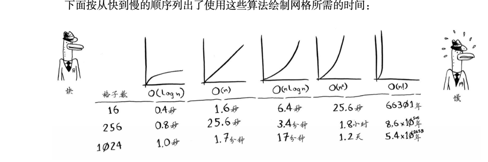

## 二分查找
每次拿中间那个数和目标数比较，每循环一次可以排除一半的数字。前提条件是列表必须有序。

Example:
```python
def binary_search(list, item):
  low = 0
  high = len(list) - 1

  while low <= high:
    mid = (low + high) // 2
    guess = list[mid]
    if guess == item:
      return mid
    if guess > item:
      high = mid - 1
    else:
      low = mid + 1
  return None


my_list = [1,3, 5, 7, 9]
print(binary_search(my_list, 5))
```

## 运行时间
大O表示法，指出了算法运行速度有多快，算法的运行时间是从增速的角度衡量的，大O表示法指出了最糟糕情况下的运行时间。
常见的大O时间：
* O(log n)，对数时间，这样的算法包括二分查找
* O(n)，也叫线性时间，这样的算法包括简单查找
* O(n * log n)，快速排序
* O(n*n)，选择排序
* O(n!)，旅行商问题解决方案


